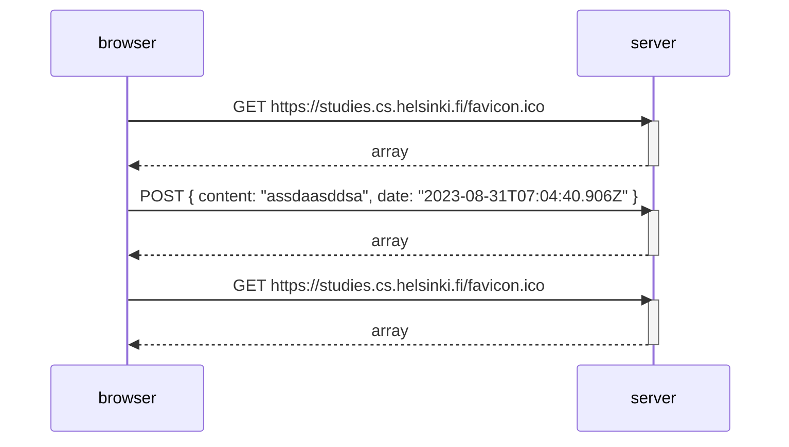

```mermaid
sequenceDiagram
    participant browser
    participant server
    
    browser->>server: GET https://studies.cs.helsinki.fi/favicon.ico
    activate server
    server-->>browser: array
    deactivate server

    browser->>server: POST { content: "assdaasddsa", date: "2023-08-31T07:04:40.906Z" }
    activate server
    server-->>browser: array
    deactivate server

    browser->>server: GET https://studies.cs.helsinki.fi/favicon.ico
    activate server
    server-->>browser: array
    deactivate server

```
